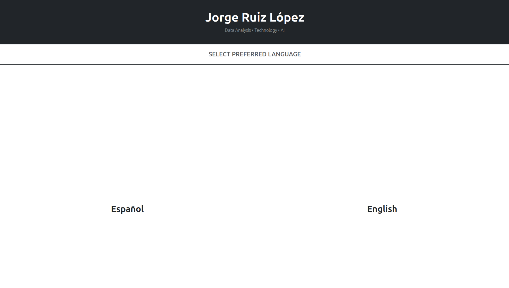
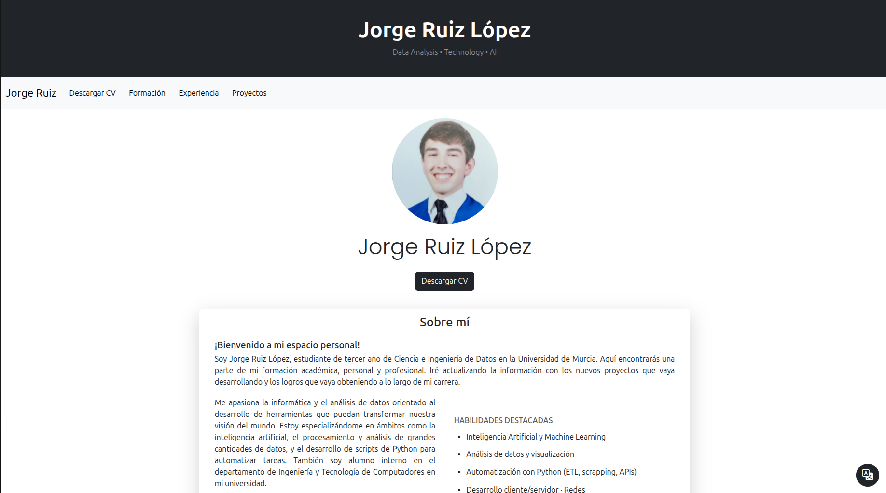

# 🌐 Personal CV Web App

Welcome to my **interactive personal website**, a project built with [Flask](https://flask.palletsprojects.com/) that works as a **dynamic CV/Portfolio**.  
The application is bilingual (**Spanish 🇪🇸 / English 🇬🇧**) and provides a modern way to showcase my education, experience, projects, skills, and contact details.

---

## ✨ Features

- **Bilingual interface** (Spanish & English).
- **Downloadable CV** in PDF format.
- Sections for **Education**, **Experience**, **Skills**, **Languages**, and **Projects**.
- Responsive design with **Bootstrap 5**.
- Direct links to **social networks and contact info**.
- Dynamic carousels for education, skills, and projects.
- Lightweight & easy to deploy with Flask.

---

## 📷 Screenshots

### 🌍 Language Selector


### 🏠 Homepage (Spanish)


---

## 🛠️ Tech Stack

- **Backend:** [Flask 3](https://flask.palletsprojects.com/)
- **Frontend:** HTML5, [Bootstrap 5](https://getbootstrap.com/), CSS3
- **Templating:** Jinja2
- **Data Handling:** Python dictionaries (`data.py`)
- **Extras:** Responsive design, Bootstrap Icons, Google Fonts

---

## 🚀 Installation & Usage

1. **Clone the repository**
	```bash
	git clone https://github.com/jorge-ruizl-um-es/my-cv-webapp.git
	cd my-cv-webapp
	```

2. **Create a virtual environment (recommended)**
	```bash
	python3 -m venv .env
	source .env/bin/activate   # Linux/Mac
	.env\Scripts\activate      # Windows
	```

3. **Install dependencies**
	```bash
	pip install -r requirements.txt
	```

4. **Run the app**
	```bash
	python run.py
	```

5. **Open the browser and go to:**
   ```bash
   http://127.0.0.1:5000/
   ```

## 📂 Project Structure

```
my-cv-webapp/
|── run.py                # Main execution script
│── requirements.txt       # Project dependencies
│── README.md              # Project documentation
│
├── app/
│   ├── __init__.py        # Flask app initialization
│   ├── data.py            # Dictionaries with personal data
│	├── static/
│   │	├── files/             # CV and certificates (PDF)
│   │	└── images/            # Profile pictures, logos, etc.
│   ├── blueprints/        # Flask blueprints (routes)
│   │   ├── english.py
│   │   ├── spanish.py
│   │   └── select_lang.py
│   └── templates/         # HTML templates (Jinja2 + Bootstrap)

```

## 📬 Contact

You can reach me through the following platforms:

- [LinkedIn](https://www.linkedin.com/in/jorge-ruiz-l%C3%B3pez-6a0101321/)
- [GitHub](https://github.com/jorge-ruizl-um-es)
- [Gmail](mailto:jorge.rulo2005@gmail.com)
- [Telegram](https://t.me/jorgeruiz_5)

---

## 📜 License

This project is licensed under the MIT License.  
Feel free to use and adapt it for your own portfolio.

---

⭐ If you like this project, consider giving it a **star** on GitHub!